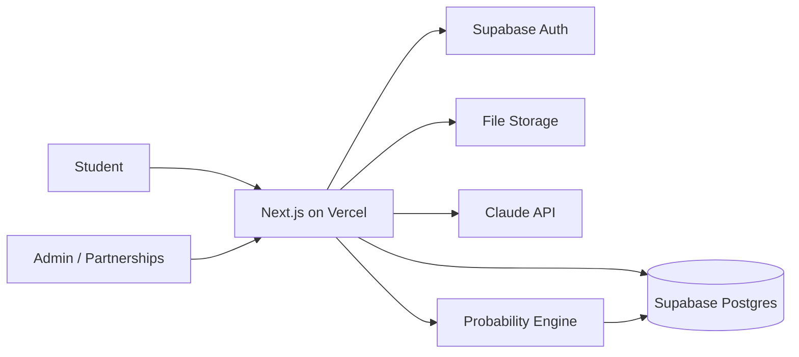

# WayAbroad

AI-powered study-abroad admissions platform — **Korea-first**. WayAbroad turns a student
profile into a ranked university shortlist, a transparent **admission-probability score**,
and editable **SOP / Study Plan** drafts, wrapped in a polished mission-tracker dashboard.

This repository is the **MVP** (Phase 1). The authoritative plan lives in
[`docs/WayAbroad_Development_Plan.md`](docs/WayAbroad_Development_Plan.md); the build brief is
[`docs/CLAUDE_CODE_BRIEF.md`](docs/CLAUDE_CODE_BRIEF.md). Progress is tracked in
[`PROGRESS.md`](PROGRESS.md).

## What the MVP proves (Definition of Done, plan §14)

A brand-new visitor can, on a live URL, in under five minutes:

1. Enter a profile **without signing up** and see a probability teaser (the hook).
2. Sign up and get a **ranked shortlist** with transparent cost breakdowns.
3. See a **real probability score with its drivers** for at least one program.
4. Generate, edit, and download an **SOP and Study Plan draft**.
5. Watch an **application move through simulated statuses** in the dashboard.

## Tech stack

| Layer | Choice |
|---|---|
| Framework | Next.js 14 (App Router) + TypeScript (strict) |
| UI | Tailwind CSS v3 + shadcn/ui |
| Data | Supabase (Postgres, Auth, Storage) — typed `supabase-js` client |
| AI | Anthropic Claude API (structured output) |
| Probability engine | Pure, unit-tested TypeScript module (Phase-2-swappable for a Python model) |
| Observability | PostHog (funnel) + Sentry (errors) — no-op stubs until keys are set |
| Hosting | Vercel-ready |

## Architecture (MVP)



For the MVP the probability engine lives **inside** the Next.js app as a scoring function.

## Getting started

> Requires Node 20+ and pnpm. The app **builds and renders with mocked data** even with no
> database or API keys configured, so you can review the UI before wiring Supabase.

```bash
pnpm install
cp .env.example .env.local   # fill in values you have; blanks fall back to mock mode
pnpm dev                     # http://localhost:3000
```

Useful scripts:

```bash
pnpm typecheck   # tsc --noEmit
pnpm lint        # eslint
pnpm test        # vitest unit tests (the probability engine is covered here from M3)
pnpm build       # production build
```

## Data & trust guardrails

The seed dataset (`database/`) is a bootstrap, and the app surfaces this honestly:

- **Admission records are synthetic** (`synthetic: true`) — anywhere they drive a number,
  the UI shows a clear **"sample data"** indicator. They exist to develop the probability
  engine and are meant to be replaced by real outcomes.
- **Cost figures are estimates** (`verify_before_launch: true`) — every displayed
  tuition/dorm/living/fee figure carries a small **"estimate — verify with the university"** note.
- **Generated documents are drafts/aids**, never finished submissions (academic-integrity).
- **Probability scores always ship with a confidence band and their drivers** — never a bare %.

## Repository layout

```
app/          Next.js App Router routes & layouts
components/    UI components (components/ui = shadcn primitives)
lib/          env loading, supabase/posthog/sentry clients, shared utils
database/      seed dataset (schema.sql + flat JSON/CSV) — source of truth for reference tables
docs/          project docs (dev plan, brief, business plan) + coursework/ (unrelated, gitignored)
scripts/       operational scripts (e.g. seed.ts, added in M1)
supabase/      migrations (added in M1)
```
