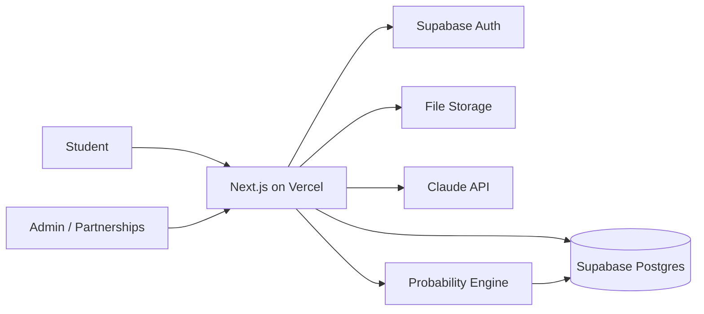

# WayAbroad — Web App Development Plan

**Author:** CTO (Habibullo Chutboev) · Team 6
**Version:** v1.0 — May 2026
**Audience:** Founding team + technical reviewers
**Companion doc:** `WayAbroad_Business_Plan.docx`

---

## 0. TL;DR

We do **not** build the "fully autonomous platform" from the pitch on day one. That's the 2-year vision. For the class demo and first real users, we ship a **thin but believable MVP in ~10 weeks** that proves the three features judges and students actually care about:

1. **AI Application Assistant** — profile in → ranked university shortlist out.
2. **Admission Probability Engine** — a clear "% chance" per university (the killer feature).
3. **Auto-Document Generator** — instant draft SOP / Study Plan from the profile.

Everything else (real university integrations, payments, the full mission-tracker) is **stubbed, faked, or scoped down** for the MVP and built for real only after we have signed partners and users. The golden rule for this phase: **demo the magic, fake the plumbing.**

---

## 1. Build Philosophy

| Principle | What it means in practice |
|---|---|
| **Demo the magic, fake the plumbing** | The probability score and document generator must be real and impressive. University "submission" can be a simulated status flow for the MVP. |
| **Buy, don't build** | Use managed services (auth, DB, hosting, LLM APIs) so 1–2 engineers can move fast. We are not building infrastructure. |
| **One codebase, one language** | TypeScript end to end. Fewer context switches for a small team. |
| **Real data beats fake data** | The probability engine's credibility comes from real admission data we collect. Start collecting from day one, even manually. |
| **Ship weekly** | A deployable build every Friday. If it's not deployed, it doesn't count. |

---

## 2. Recommended Tech Stack

Optimized for a small team, fast iteration, and AI features. All have generous free tiers — MVP can run at **~$0–50/month** until real traffic.

| Layer | Choice | Why |
|---|---|---|
| **Framework** | **Next.js 14 (App Router) + TypeScript** | Frontend + backend in one repo. Server actions and API routes mean no separate backend service for the MVP. Huge ecosystem, easy hiring. |
| **UI** | **Tailwind CSS + shadcn/ui** | Production-looking UI fast. The dashboard "mission tracker" needs to look polished for judges. |
| **Database** | **PostgreSQL (Supabase or Neon)** | Relational data (students, universities, applications) fits SQL perfectly. Supabase also gives auth + file storage out of the box. |
| **ORM** | **Prisma** | Type-safe DB access, clean migrations, fast to model entities. |
| **Auth** | **Supabase Auth** (or Clerk) | Email + Google login in an afternoon. Don't build auth. |
| **File storage** | **Supabase Storage** (or S3) | Passport/transcript uploads. |
| **AI / LLM** | **Anthropic Claude API** (primary) + structured output | Powers the document generator and the advisory chatbot. Use structured/JSON output for reliability. |
| **Probability engine** | **Python micro-service (FastAPI)** *or* TS logic | Start as simple weighted-scoring logic in TS; migrate to a Python service with a real model once we have data. |
| **Hosting** | **Vercel** (app) + **Supabase** (data) | Git push = deploy. Preview URLs per PR are great for sharing with the team and judges. |
| **Email/notifications** | **Resend** | Application status updates. Trivial to integrate. |
| **Analytics** | **PostHog** (free tier) | Funnel tracking — critical to prove the "free probability check" hook converts. |
| **Error monitoring** | **Sentry** | Catch breakage before a judge does. |

> **Why not no-code?** A no-code tool gets you a form, but it can't do the probability scoring or document generation that *is the product*. Next.js gives us speed without capping the ceiling.

---

## 3. System Architecture (MVP)

```
                    ┌──────────────────────────────┐
                    │        Next.js (Vercel)       │
   Student ───────▶ │  ── App Router (React UI) ──  │
   (browser/mobile) │  ── Server actions / API ──   │
                    └───────┬───────────────┬───────┘
                            │               │
              ┌─────────────▼──┐     ┌──────▼────────────┐
              │  Supabase       │     │  Claude API        │
              │  - Postgres     │     │  - SOP / Study Plan │
              │  - Auth         │     │  - Advisory chatbot │
              │  - File storage │     └─────────────────────┘
              └─────────────┬──┘
                            │
              ┌─────────────▼──────────────┐
              │ Probability Engine          │
              │ (TS rules → Python model)   │
              │ uses Universities + history │
              └─────────────────────────────┘
```

**Mermaid version (for repo README):**



For the MVP, the probability engine lives **inside the Next.js app** as a scoring function. We only split it into a separate Python/FastAPI service once we have enough real outcome data to train a statistical model (Phase 2).

---

## 4. Core Data Model

The whole product hangs off a handful of entities. Get these right early.

| Entity | Key fields | Notes |
|---|---|---|
| **Student** | id, name, email, country, gpa, gpa_scale, language_test, language_score, budget, intended_degree, intended_field | The profile that drives everything. |
| **University** | id, name, country, tier, tuition, living_cost, dorm_cost, visa_cost | Seed manually with ~30 Korean universities for the MVP. |
| **Program** | id, university_id, name, degree_level, min_gpa, min_language_score, deadline, scholarship_notes | Many programs per university. |
| **AdmissionRecord** | id, program_id, applicant_gpa, applicant_lang, outcome (admit/reject), year | The fuel for the probability engine. Collect from day one. |
| **Application** | id, student_id, program_id, status, probability_score, created_at | `status`: draft → submitted → under_review → interview → decision. |
| **Document** | id, application_id, type (SOP/study_plan/personal_statement), content, version | LLM-generated, student-editable. |
| **UniversityPartner** | id, university_id, lead_fee, enrollment_fee, contact | The revenue side; mostly admin-managed at MVP. |

Seed data plan: the CMO/COO manually research and enter **~30 mid-tier Korean universities** with real tuition, dorm, and visa costs. Real numbers here are what make the cost-transparency feature credible.

---

## 5. MVP Scope — In / Out

### ✅ In scope (the 10-week build)

- **Onboarding & profile** — student enters GPA, language score, budget, target field. Email/Google login.
- **AI Application Assistant** — returns a ranked shortlist of matching programs from our seeded universities.
- **Admission Probability Engine v1** — a transparent weighted score per program, shown with the factors behind it.
- **Auto-Document Generator** — Claude drafts an SOP and Study Plan from the profile; student can edit and download.
- **Cost Transparency** — per-university breakdown (tuition + dorm + visa + living) from seeded data.
- **Smart Dashboard** — the mission-tracker UI with checklist steps and a **simulated** status flow (admin can advance status manually).
- **Free probability check (no login)** — the top-of-funnel hook: enter a profile, get a teaser result, then prompt to sign up.
- **Basic admin panel** — manage universities, advance application status, view leads.

### ❌ Out of scope (deliberately deferred)

- Real-time API integrations with university admission systems (none exist / not needed yet — simulate).
- Payments / premium tier billing (Stripe comes in Phase 2 once there's demand).
- The trained ML probability model (start with rules; train later on collected data).
- Native mobile apps (responsive web only — it works fine on phones).
- Housing/insurance ancillary marketplace.
- Multi-language UI (English first; localize after Korea traction).

> The discipline here is everything. Every "wouldn't it be cool if…" that isn't on the In list goes into the backlog, not the sprint.

---

## 6. The Two Hard Parts (and how to do them pragmatically)

### 6.1 Admission Probability Engine

**Don't** pretend it's a neural network on day one. **Do** build an honest, explainable scoring model:

```
score = w1 * gpa_fit + w2 * language_fit + w3 * program_selectivity + w4 * budget_fit
```

- Normalize the student's GPA and language score against each program's stated minimums.
- Blend in any `AdmissionRecord` data we've collected (even 20–30 real outcomes per popular program meaningfully sharpens it).
- **Present the score with a confidence band** (e.g., "≈70%, moderate confidence") and the drivers behind it. Honesty here protects the brand when an early prediction is wrong.
- Log every prediction and, later, the actual outcome. That feedback loop is the moat — it's why a copycat can't catch up.

**Phase 2:** once we have a few hundred real outcomes, replace the weights with a logistic regression / gradient-boosted model in a small Python FastAPI service. Same interface, better numbers.

### 6.2 Auto-Document Generator

- Use **Claude with a structured prompt** built from the student profile + target program.
- Generate **editable drafts**, never "final" documents — position it as a drafting aid, not a ghostwriter (this is also the answer to the academic-integrity risk in the business plan).
- Keep a `version` history so students can revise.
- Add a lightweight quality-check pass (length, tone, required elements) before showing the draft.
- Store prompt templates per document type so we can iterate on quality without code changes.

---

## 7. 10-Week Sprint Plan

Two-week sprints. Every Friday: a deployed build.

| Week | Sprint goal | Key deliverables |
|---|---|---|
| **0 (pre-flight)** | Setup | Repo, Next.js + Tailwind scaffold, Supabase project, Vercel deploy, CI, Sentry. "Hello world" live on a URL. |
| **1–2** | Foundations + data model | Auth (login/signup), Prisma schema for all core entities, admin can add universities/programs, seed 30 Korean unis with real cost data. |
| **3–4** | Profile + Assistant | Student onboarding flow, profile capture, ranked shortlist (matching logic), university detail pages with cost breakdown. |
| **5–6** | Probability Engine v1 | Weighted scoring, score display with drivers + confidence band, free no-login probability check (the funnel hook), PostHog funnel events. |
| **7–8** | Document Generator | Claude integration, SOP + Study Plan generation, editor with version history, download as PDF/Word. |
| **9** | Dashboard + status flow | Mission-tracker UI, application checklist, simulated status progression, email notifications via Resend. |
| **10** | Polish + demo hardening | UX pass, mobile responsive QA, seed demo accounts, write the **judge demo script**, load-test the happy path, fix Sentry issues. |

**Buffer reality check:** if we slip, cut the dashboard status emails and the chatbot first — never cut the probability score or document generator, those *are* the demo.

---

## 8. Team & Ownership

Mapped to the founding roles so there's a single owner per area.

| Owner | Role | Build responsibility |
|---|---|---|
| **Habibullo (CTO)** | Engineering lead | Architecture, probability engine, code review, deploys |
| **Sunnatjon (CPO)** | Product | User flows, dashboard UX, document-generator prompts, backlog discipline |
| **Mikhail (COO)** | Ops | Seeding university/cost data, admin panel testing, status-flow logic, student support |
| **Jasmina (CMO)** | Growth | Landing page copy, the free-probability-check funnel, PostHog goals, demo storytelling |
| **Amarbat (CFO)** | Finance | API/infra cost tracking, premium-tier pricing model for Phase 2 |
| **Firdavs (CEO)** | Partnerships | Recruiting 2–3 pilot universities to provide real admission data + act as demo partners |

If only one or two people can actually code, **Habibullo + one engineer drive the build**; everyone else owns content, data, and go-to-market in parallel. Consider one contract front-end developer for weeks 3–8 if budget allows (covered under the $120K MVP line in the business plan).

---

## 9. Dev Workflow & Tooling

- **Git + GitHub**, trunk-based with short-lived feature branches. PRs reviewed by the CTO.
- **Vercel preview deploys** on every PR — share a live URL with the team in minutes.
- **Linting/formatting:** ESLint + Prettier, enforced in CI.
- **CI:** GitHub Actions runs typecheck + lint + build on every push. No red builds merge.
- **Environments:** `production` (main branch) and `preview` (PRs). One Supabase project for MVP; add a staging DB before real users.
- **Secrets** in Vercel/Supabase env vars — never in the repo.
- **Task tracking:** a simple board (GitHub Projects/Linear). The "Out of scope" list lives here as the backlog.

---

## 10. Cost Estimate (MVP phase)

| Item | Monthly (MVP) | Notes |
|---|---|---|
| Vercel | $0–20 | Hobby/Pro tier |
| Supabase | $0–25 | Free tier covers MVP; Pro when storage/auth grows |
| Claude API | $20–150 | Scales with document generations; cache + cap per user |
| Resend, PostHog, Sentry | $0 | Free tiers sufficient at MVP scale |
| Domain | ~$15/yr | wayabroad.io or similar |
| **Total** | **~$40–200/mo** | Comfortably inside the business plan's start-up budget |

The biggest variable is LLM spend. Mitigate with per-user generation limits, prompt caching, and a smaller/cheaper model for non-critical text.

---

## 11. Security, Privacy & Compliance

Students hand us passports, transcripts, and personal data — trust is the whole brand, so this isn't optional.

- **Encrypt in transit and at rest** (Supabase handles at-rest; HTTPS everywhere via Vercel).
- **Minimize PII** — only collect what a recommendation actually needs.
- **Access control** — row-level security in Supabase so a student only ever sees their own data.
- **File handling** — virus-scan uploads, restrict types, private storage buckets with signed URLs.
- **Consent + transparency** — clear privacy policy; explicit consent before sharing a profile with a university (this *is* the lead, so consent is also a legal must).
- **Korea-specific:** plan for **PIPA** (Personal Information Protection Act) compliance as we onboard real Korean students — the CEO should confirm requirements with a local advisor before launch.
- **AI integrity** — documents are clearly labeled drafts/aids; log generations for accountability.

---

## 12. Post-MVP Roadmap

| Phase | Timeline | Focus |
|---|---|---|
| **Phase 1 — MVP** | Weeks 0–10 | The 3 core features + dashboard, demo-ready, first pilot users |
| **Phase 2 — Validate** | Months 3–6 | Stripe for premium tier, trained probability model on real data, real university partner workflow, advisory chatbot, A/B test the funnel |
| **Phase 3 — Scale** | Months 6–12 | Multi-university submission workflows, housing/insurance ancillary integrations, performance/observability hardening, prepare for Japan corridor (i18n) |
| **Phase 4 — Expand** | Year 2 | Destination-agnostic platform, partner API/portal, mobile apps, data-team-owned probability model |

The architecture above is built so Phase 2–4 are *extensions*, not rewrites: the probability engine swaps its internals, the doc generator improves its prompts, and new destinations reuse the same schema with localized content.

---

## 13. Technical Risks

| Risk | Mitigation |
|---|---|
| LLM output quality / hallucination in documents | Structured prompts, quality-check pass, editable drafts, human-in-the-loop positioning |
| Probability scores look wrong early (little data) | Confidence bands, transparency about drivers, aggressive real-outcome collection |
| Scope creep blows the 10-week timeline | Hard "Out of scope" list, weekly deploy discipline, cut chatbot/emails before core features |
| Small team / bus factor | Trunk-based simple stack, documented setup, one contract dev as buffer |
| API cost spike | Per-user caps, prompt caching, cheaper model for low-stakes text, cost alerts |
| Data privacy incident | RLS, encryption, minimal PII, PIPA review before real launch |

---

## 14. Definition of Done (MVP)

The MVP is "done" when a brand-new visitor can, on a live URL, in under five minutes:

1. Enter a profile **without signing up** and see a probability teaser (the hook).
2. Sign up and get a **ranked shortlist** with transparent cost breakdowns.
3. See a **real probability score with its drivers** for at least one program.
4. Generate and edit an **SOP and Study Plan draft**, then download it.
5. View an **application in the dashboard** moving through simulated statuses.

If a judge can do all five smoothly on their own phone, we win the demo — and we have a real product to build the rest on.

---

*This plan is intentionally lean. The goal of Phase 1 is not to build WayAbroad — it's to build the smallest thing that proves WayAbroad is real, to both users and investors.*
